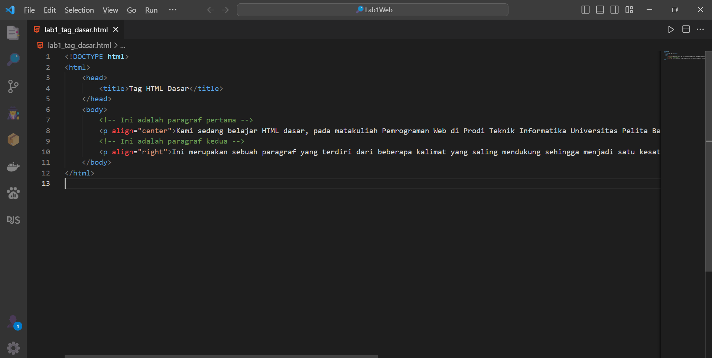
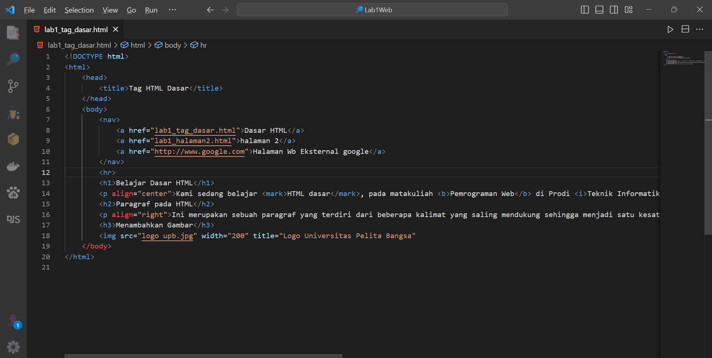

# Penjelasan

### Persiapan
- tampilan awal vscode

- install Live Server

ini untuk host lokal
1. menambahkan tag dasar dokumen html

membuka file pada chrome

2. membuat paragraph

refresh halaman

3. mengatur atribut pada paragraf

refresh halaman

4. menambahkan judul

refresh halaman

5. memformat teks

refresh halaman

6. menambahkan gambar gambar

refresh halaman

7. mengatur ukuran gambar

refresh halaman

8. menambahkan hyperlink

refresh halaman

# Jawab Pertanyaaan Berikut
1. Lakukan perubahan pada kode sesuai dengan keinginan anda, amati perubahannya adakah error ketika terjadi kesalahan penulisan tag?

A: ketika mengubah tag seperti <h1>kalimat<h> h1 akan mengubah kalimat menjadi tebal dan besar tetapi akan menampilkan yang tidak sesuai yang diinginkan

2. Apa perbedaan dari tag 
 dengan tag  , berikan penjelasannya!

: adalah tag paragraf
- tag ditulis diawal dan diakhir, syntaxnya 
kalimat

- digunakan untuk menampung teks
 : adalah tag garis baru
- tag ditulis di akhir, syntaxnya kalimat 
- digunakan untuk memaksa jeda baris

3. Apa perbedaan atribut title dan alt pada tag , berikan penjelasannya!

A: alt = digunakan untuk memberikan teks alternatif yang akan ditampilkan jika gambar tidak dapat dimuat. dan title = digunakan untuk memberikan teks yang akan muncul saat user mengarahkan kursor mouse ke gambar

4. Untuk mengatur ukuran gambar, digunakan atribut width dan height. Agar tampilan gambar proporsional sebaiknya kedua atribut tersebut diisi semua atau tidak? Berikan penjelasannya!

- ketika mengisi kedua atribut, gambar tetap proporsional dan sesuai dengan ukuran yang ditentukan
- ketika mengisi salah satu atribut misal width, otomatis tinggi gambar tersebut akan sesuai dengan rasio gambar asli

5. Pada link tambahkan atribut target dengan nilai atribut bervariasi ( _blank, _self, _top, _parent ), apa yang terjadi pada masing-masing nilai antribut tersebut?

A: berikut adalah tindakan jika diklik
- _blank = Ketika tautan ini diklik, halaman yang terhubung akan dibuka dalam jendela atau tab browser baru.
- _self = Ini adalah nilai default jika target tidak ditentukan. Ketika tautan ini diklik, halaman yang terhubung akan ditampilkan dalam jendela atau tab yang sama di mana tautan tersebut ada.
- _top = halaman yang terhubung akan ditampilkan dalam jendela atau tab utama (paling atas) dalam hierarki jendela browser
- _parent = halaman yang terhubung akan ditampilkan dalam jendela atau tab yang merupakan "induk" langsung dari halaman saat ini.